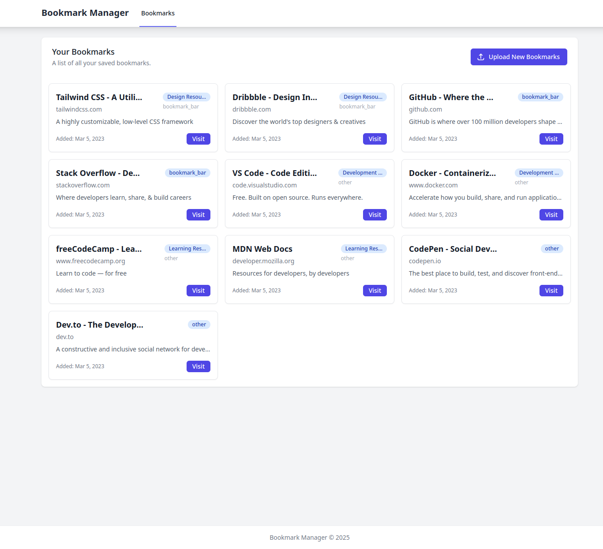
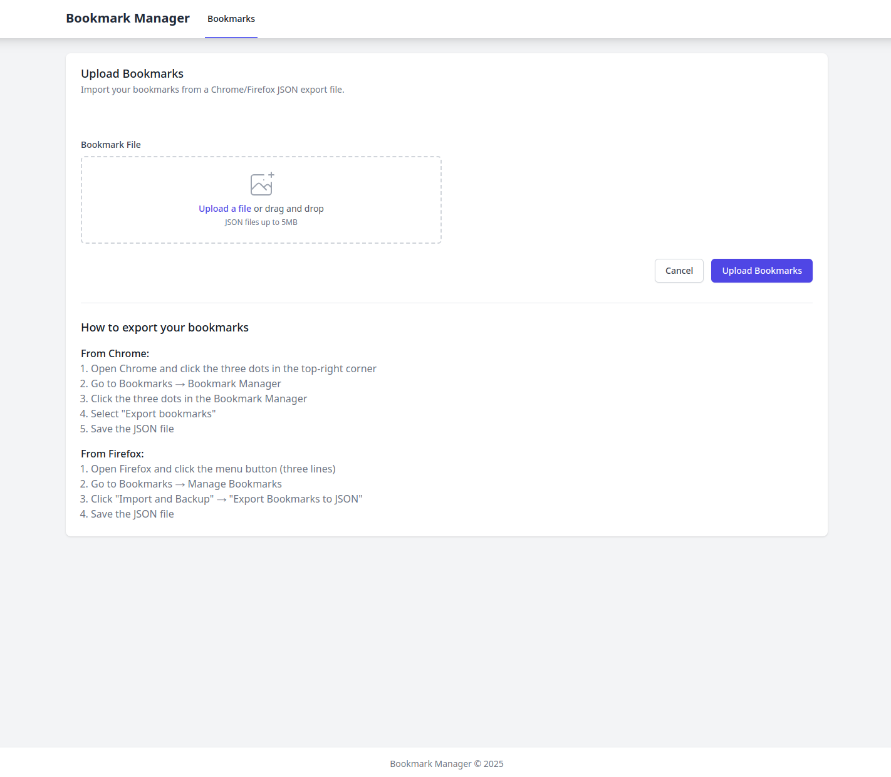

# Bookmark Manager

A web application built with CodeIgniter 4 that allows users to import and manage their browser bookmarks.

## Features

- Import bookmarks from Chrome/Firefox JSON export files via drag & drop or file selection
- View all bookmarks in an organized grid layout
- Displays bookmark titles, URLs, folders, descriptions and date added
- Maintains folder structure from original browser bookmarks
- Clean, responsive UI built with Tailwind CSS

## Technical Details

- Built using CodeIgniter 4 PHP framework
- Modular architecture with BookmarkManager module
- PSR-12 code style compliance using PHP CS Fixer
- Input validation and sanitization
- Error handling for file uploads
- Responsive design using Tailwind CSS

### Test data included ./test.json

## Screenshots

### Bookmarks Index Page

### Upload Bookmarks Page

